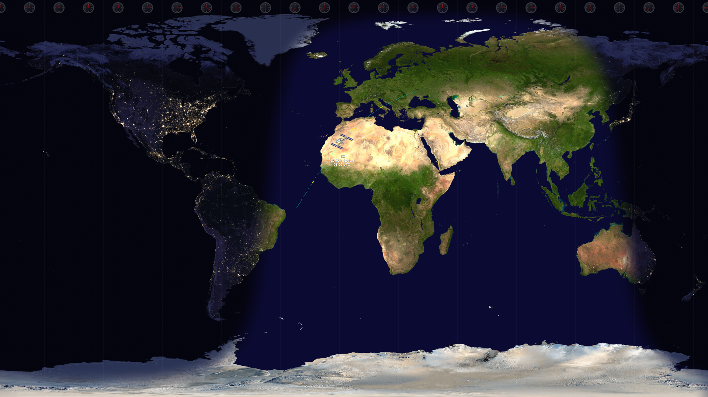

# WorldMapWallpaper

A comprehensive Windows desktop wallpaper suite that generates and manages dynamic world maps showing real-time day/night cycles, timezone clocks, and International Space Station tracking. Features a modern settings interface with automatic theme support and intelligent wallpaper management.

## 🌍 Features

### Core Wallpaper Engine
- **Real-time day/night cycle** - Calculates and displays the actual solar terminator line based on current UTC time and sophisticated astronomical calculations
- **Timezone visualization** - Shows 24 analog clocks across time zones with accurate local times
- **Professional ISS tracking** - Uses SGP4 orbital mechanics with TLE data for precise satellite positioning and orbital path prediction
- **Political boundaries** - Optional overlay of country borders and political maps
- **High-performance rendering** - Optimized image processing with Gaussian blur for smooth day/night transitions

### Modern Settings Interface
- **Theme-aware UI** - Automatically detects and applies Windows dark/light theme
- **Real-time configuration** - Settings changes are immediately applied and saved
- **Visual toggles** - Control ISS tracking, timezone clocks, and political boundaries
- **Update frequency control** - Choose from 5-minute to hourly update intervals
- **One-click wallpaper update** - Preview changes instantly

### Intelligent Management
- **Automatic scheduling** - Multiple triggers for wallpaper updates (boot, login, wake, time-based)
- **Wallpaper monitoring** - Detects when user switches to different wallpaper and gracefully disables automation
- **Task status display** - Real-time monitoring of scheduled task state and next execution time
- **Smart conflict resolution** - Handles multiple instances and prevents file locking issues

## 🚀 Quick Start

1. **Download** the latest `Install.exe` from the [Releases](../../releases) page
2. **Run installer** as administrator to set up the complete suite
3. **Configure settings** using the modern settings interface (automatically launched)
4. **Enjoy** your dynamic wallpaper that updates automatically

## 🛠️ How It Works

The application performs sophisticated astronomical and rendering calculations:

1. **Solar Position Calculation** - Uses vernal equinox as reference point to calculate sun's declination
2. **Terminator Curve Generation** - Calculates day/night boundary using spherical trigonometry 
3. **Alpha Mask Creation** - Generates smooth transition masks with Gaussian blur
4. **Layer Composition** - Composites day earth, night earth, political boundaries, and overlays
5. **ISS Orbital Tracking** - Uses SGP4 propagator with TLE data from CelesTrak for professional satellite tracking
6. **Timezone Clock Rendering** - Draws 24 analog clocks showing accurate local times
7. **Desktop Integration** - Sets result as wallpaper using Windows SystemParametersInfo API

## 📦 Installation & Setup

### Automatic Installation (Recommended)
The installer handles complete setup including:
- Deployment to `C:\Program Files\WorldMapWallpaper`
- Scheduled task configuration with multiple triggers
- Initial wallpaper generation
- Settings interface launch

### Manual Configuration
Access settings anytime by running:
```cmd
WorldMapWallpaper.exe --settings
```

## ⚙️ System Requirements

- **OS**: Windows 10 version 1809 (17763) or later
- **Framework**: .NET 9.0 Runtime (embedded in installer)
- **Memory**: 512MB RAM minimum
- **Storage**: 50MB disk space
- **Network**: Internet connection optional (for TLE data updates)

## 📍 File Locations

| Component | Location |
|-----------|----------|
| **Application** | `C:\Program Files\WorldMapWallpaper\` |
| **Generated wallpapers** | `%USERPROFILE%\Pictures\WorldMap01.jpg` / `WorldMap02.jpg` |
| **Application logs** | `C:\Program Files\WorldMapWallpaper\log\WorldMapWallpaper.log` |
| **TLE cache** | `%APPDATA%\WorldMapWallpaper\iss_tle_cache.json` |
| **Settings storage** | Windows Registry (application-managed) |

## 🔧 Advanced Configuration

### Update Frequency Options
- **Every 5 minutes** - Maximum accuracy for rapidly changing ISS position and terminator
- **Every 10 minutes** - Balanced performance and accuracy
- **Every 15 minutes** - Recommended for most users
- **Every 30 minutes** - Light system impact
- **Hourly** - Minimal system impact, still captures major changes

### Scheduled Task Triggers
The installer configures multiple triggers for comprehensive automation:
- **System startup** - Ensures wallpaper is set on boot
- **User logon** - Updates wallpaper when user signs in
- **System wake** - Refreshes wallpaper after sleep/hibernation
- **Time-based** - Regular updates based on configured interval

### Manual Task Management
If manual task scheduler configuration is needed:
- Set "Run only when user is logged on"
- Enable "Run with highest privileges"
- Set multiple instances policy to "Do not start a new instance"

## 🔬 Technical Architecture

### Solution Structure
- **ImagePainter** - Core wallpaper generation engine
- **Settings** - Modern UI for configuration management
- **Shared** - Common utilities and Windows integration

### Key Technologies
- **Astronomical calculations** - Solar position and terminator curve algorithms
- **Image processing** - Multi-threaded operations with unsafe code optimization
- **Windows integration** - Task Scheduler, SystemParametersInfo APIs
- **Satellite tracking** - SGP4 orbital mechanics with TLE data from CelesTrak
- **Theme detection** - Windows registry monitoring for dark/light mode

### Performance Features
- **Parallel processing** - Multi-core utilization for image operations
- **Memory management** - Proper disposal patterns for graphics resources
- **File conflict avoidance** - Alternating output filenames
- **Caching strategy** - TLE data persistence for offline satellite tracking

## 🌐 External Data Sources

- **TLE Data**: [CelesTrak](https://celestrak.org/NORAD/elements/gp.php?GROUP=stations&FORMAT=tle) - Official satellite orbital elements
- **Fallback ISS API**: [Open Notify API](http://api.open-notify.org/iss-now.json) - Used if TLE calculations fail
- **Offline Operation**: TLE data cached locally for up to 1 week

## 🎨 Example Output



*Real-time wallpaper showing current day/night terminator, timezone clocks, ISS position with directional orbital path, and political boundaries overlay.*

## 🏗️ Development

### Building from Source
```cmd
# Development build
build.bat

# Release build with installer
build.bat Release
```

### Project Structure
```
WorldMapWallpaper/
├── ImagePainter/          # Main wallpaper engine
├── Settings/              # Configuration UI
├── Shared/                # Common utilities
├── build.bat              # Advanced build script
└── DateVersioning.targets # Automatic versioning
```

See [CLAUDE.md](CLAUDE.md) for comprehensive development documentation.

## 📄 License

This project is licensed under the MIT License - see the [LICENSE](LICENSE) file for details.

## 🤝 Contributing

Contributions are welcome! Please feel free to submit pull requests or open issues for bugs and feature requests.

---

*WorldMapWallpaper - Bringing the world to your desktop, one pixel at a time.* 🌍✨
