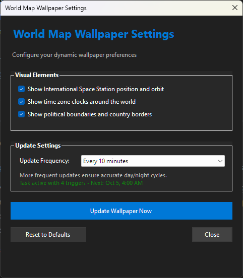

# 🌍 World Map Wallpaper - User Manual

## Table of Contents
1. [Overview](#overview)
2. [Installation](#installation)
3. [Getting Started](#getting-started)
4. [Settings Interface](#settings-interface)
5. [System Tray Features](#system-tray-features)
6. [Configuration Options](#configuration-options)
7. [Troubleshooting](#troubleshooting)
8. [Uninstallation](#uninstallation)

---

## Overview

World Map Wallpaper is a dynamic desktop wallpaper application that displays a real-time world map showing:
- **Day/Night Terminator Line**: Visual representation of where it's day and night on Earth
- **International Space Station (ISS) Tracking**: Real-time position and orbital path
- **World Time Zone Clocks**: 24 analog clocks showing local time around the globe
- **Political Boundaries**: Country borders and geographical features

The application automatically updates your wallpaper at configurable intervals to reflect the current time and solar position.

---

## Installation

### Running the Installer

1. **Download** the `Install.exe` file from the releases page
2. **Right-click** on `Install.exe` and select **"Run as administrator"**
3. **Follow the installation wizard**:
   - Click **"Next"** to proceed through the welcome screen
   - **Accept the license agreement**
   - **Choose installation directory** (default: `C:\Program Files\WorldMapWallpaper`)
   - Click **"Install"** to begin installation

### What Gets Installed

The installer will automatically:
- ✅ Install the main wallpaper application
- ✅ Install the settings configuration tool
- ✅ Create Windows scheduled tasks for automatic updates
- ✅ Register the application with Windows Event Log
- ✅ Set up the Settings app to start with Windows (minimized to system tray)
- ✅ Generate your first dynamic wallpaper
- ✅ Launch the settings interface for initial configuration

---

## Getting Started

### First Launch

After installation, you'll see:

1. **Initial Wallpaper Generation**: The installer runs the main application to create your first wallpaper
2. **Settings Window Opens**: The configuration interface appears automatically
3. **System Tray Icon**: A World Map Wallpaper icon appears in your system tray



*The Settings window showing all configuration options*

### Immediate Actions You Can Take

- **Configure preferences** in the Settings window
- **Click "Update Wallpaper Now"** to apply your settings immediately
- **Minimize the settings** by clicking the "Close" button (it goes to system tray)
- **Access the app anytime** via the system tray icon

---

## Settings Interface

### Main Settings Window

The Settings window provides a clean, modern interface with the following sections:

#### Visual Elements
Configure what appears on your wallpaper:

- ☑️ **Show International Space Station position and orbit**
  - Displays the ISS's current location as a small icon
  - Shows the orbital path as a curved line
  - Updates in real-time based on NASA data

- ☑️ **Show time zone clocks around the world**
  - 24 analog clocks positioned globally
  - Each clock shows the local time for that region
  - Available in 32px and 48px sizes

- ☑️ **Show political boundaries and country borders**
  - Overlay of world political map
  - Country borders and geographical boundaries
  - Helps identify regions and nations

#### Update Settings
Control how frequently your wallpaper refreshes:

- **Update Frequency**: Dropdown menu with options:
  - Every 5 minutes
  - Every 10 minutes
  - Every 15 minutes
  - Every 30 minutes
  - Every hour

- **Information Text**: Explains that "More frequent updates ensure accurate day/night cycles"
- **Task Status**: Shows current scheduled task status and next execution time

#### Action Buttons

- **🔄 Update Wallpaper Now**: Immediately applies current settings and generates new wallpaper
- **🔄 Reset to Defaults**: Restores all settings to original values (with confirmation)
- **❌ Close**: Minimizes the window to system tray (doesn't exit the application)

---

## System Tray Features

### Tray Icon

The World Map Wallpaper icon in your system tray provides quick access to all features:


*System tray area showing the World Map Wallpaper icon*

### Right-Click Context Menu

Right-click the tray icon to access:

- **⚙️ Settings** (Bold): Opens the main settings window
- **🔄 Update Wallpaper Now**: Instantly updates your wallpaper
- **❌ Exit**: Completely closes the application

### Double-Click Action

**Double-click** the tray icon to quickly open the Settings window.

### Notification Messages

The application shows helpful balloon notifications for:
- ✅ **Successful wallpaper updates**: "Wallpaper updated successfully!"
- ⚠️ **Update failures**: "Failed to update wallpaper"
- ℹ️ **User wallpaper changes**: "Automatic updates disabled - you switched to a different wallpaper"
- 🔄 **Update progress**: "Updating wallpaper..."

---

## Configuration Options

### Update Frequency Details

| Frequency | Best For | Description |
|-----------|----------|-------------|
| **5 minutes** | Maximum accuracy | Perfect terminator line tracking, highest ISS accuracy |
| **10 minutes** | Balanced performance | Good accuracy with reasonable resource usage |
| **15 minutes** | Standard use | Recommended for most users |
| **30 minutes** | Light usage | Good for older computers or minimal updates |
| **1 hour** | Minimal updates | Basic day/night cycle tracking |

### Visual Element Impact

| Element | Performance Impact | Visual Benefit |
|---------|-------------------|----------------|
| **ISS Tracking** | Low | High - shows real space activity |
| **Time Zone Clocks** | Medium | High - practical world time reference |
| **Political Boundaries** | Low | Medium - geographical context |

### Automatic Wallpaper Monitoring

The application intelligently monitors your wallpaper:
- **Detects changes**: When you set a different wallpaper
- **Disables automation**: Stops overwriting your choice
- **Shows notification**: Informs you that automatic updates are disabled
- **Respects user choice**: Won't re-enable unless you manually update

---

## Troubleshooting

### Common Issues

#### Settings Window Won't Open
- **Check system tray**: Look for the World Map Wallpaper icon
- **Double-click tray icon**: Should restore the window
- **Restart application**: Run `WorldMapWallpaper.Settings.exe` from install directory

#### Wallpaper Not Updating
- **Check task status**: Look at the task status in Settings window
- **Manual update**: Click "Update Wallpaper Now" button
- **Verify permissions**: Ensure the app has permission to change wallpaper
- **Check scheduled tasks**: Open Windows Task Scheduler and look for "World Map Wallpaper" task

#### ISS Position Not Showing
- **Check internet connection**: ISS data requires internet access
- **Firewall settings**: Ensure the app can access NASA APIs
- **Wait for next update**: ISS data is cached and updates periodically

#### Performance Issues
- **Reduce update frequency**: Choose longer intervals (30min or 1 hour)
- **Disable heavy features**: Turn off time zone clocks if needed
- **Close settings window**: Minimize to tray when not configuring

### Log Files

The application creates detailed logs for troubleshooting:
- **Location**: `C:\Program Files\WorldMapWallpaper\log\`
- **Files**: Application logs with timestamps
- **Windows Event Log**: Check Windows Event Viewer under "Application" logs

### Getting Help

If you encounter issues:
1. **Check this manual** for common solutions
2. **Review log files** for error messages
3. **Try manual wallpaper update** first
4. **Restart the application**
5. **Reinstall if necessary**

---

## Uninstallation

### Using Windows Settings
1. Open **Windows Settings** (`Win + I`)
2. Go to **Apps & features**
3. Search for **"World Map Wallpaper"**
4. Click **"Uninstall"** and follow prompts

### Using Control Panel
1. Open **Control Panel** → **Programs and Features**
2. Find **"World Map Wallpaper"** in the list
3. Click **"Uninstall"** and follow the wizard

### What Gets Removed
The uninstaller will:
- ✅ Remove all application files
- ✅ Delete scheduled tasks
- ✅ Remove Windows Event Log entries
- ✅ Clean up registry entries
- ✅ Remove startup registration

### Manual Cleanup (if needed)
If automatic uninstallation fails:
1. **Stop any running processes**: End `WorldMapWallpaper.Settings.exe` in Task Manager
2. **Delete install directory**: Remove `C:\Program Files\WorldMapWallpaper`
3. **Remove scheduled task**: Delete "World Map Wallpaper" task in Task Scheduler
4. **Clean startup entry**: Remove from `HKLM\SOFTWARE\Microsoft\Windows\CurrentVersion\Run`

---

## Advanced Features

### Command Line Usage

The Settings application supports command-line arguments:

```bash
# Start minimized to tray (used by startup)
WorldMapWallpaper.Settings.exe --minimized

# Alternative syntax
WorldMapWallpaper.Settings.exe /minimized
```

### Scheduled Task Details

The application creates a sophisticated scheduled task with multiple triggers:
- **System startup**: Ensures wallpaper is set on boot
- **User logon**: Updates wallpaper when you log in
- **System wake**: Refreshes after sleep/hibernation
- **Periodic intervals**: Based on your chosen frequency

### File Locations

| Component | Location |
|-----------|----------|
| **Main Application** | `C:\Program Files\WorldMapWallpaper\WorldMapWallpaper.exe` |
| **Settings App** | `C:\Program Files\WorldMapWallpaper\WorldMapWallpaper.Settings.exe` |
| **Configuration** | Windows Registry + Application Settings |
| **Log Files** | `C:\Program Files\WorldMapWallpaper\log\` |
| **Generated Wallpapers** | `%USERPROFILE%\Pictures\` (WorldMap01.jpg, WorldMap02.jpg) |

---

## Tips & Best Practices

### Optimal Settings
- **For accuracy**: Use 5-10 minute updates with all visual elements enabled
- **For performance**: Use 30-60 minute updates with minimal visual elements
- **For laptops**: Use longer intervals when on battery power

### Visual Customization
- **Enable all elements** for the most informative wallpaper
- **Disable political boundaries** for a cleaner look
- **Keep ISS tracking** for educational and visual interest

### System Integration
- **Keep the app in system tray** for easy access
- **Use notification bubbles** to stay informed of updates
- **Let the app manage itself** - it's designed to be hands-off

---

*Generated with [Claude Code](https://claude.ai/code)*

**Version**: 1.0 | **Last Updated**: October 2025